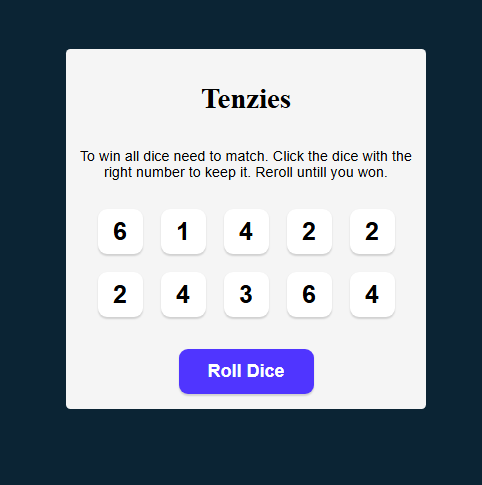
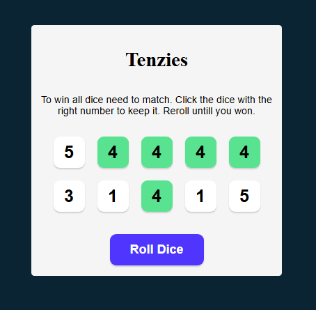
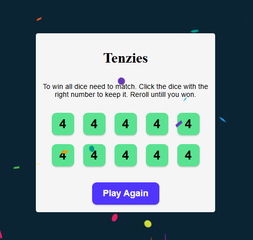

# Sebastian Riedel Portfolio

Welcome to my portfolio! Here you'll find some of the web projects I've built.

---

### 1. Tenzies Game
**Description:**  
This app generates a game of Tenzies. The basic principal of the game is to collect the same dice value on all dices as quick as possible. The user can save/hold dice values and only reroll dice values that differentiate. Once the user has save/holds all dice of the same value he won the game and can restart the game.

Since I am using a AI, I had to use a personal token, which I cannot upload to github. Therefor I can't present a running live demo.

**GitHub Repo:** [Link to repo](https://github.com/SebastianR0589/tenzies_game_project)

**Screenshots:**

**Features:**
- Fetch user preverences 
- Generates AI prompt to generate a recommendation list
- Creates a recommendation list based upon the AI response using react-markdown

**Tech Stack:**  
React, API integration, react-markdown